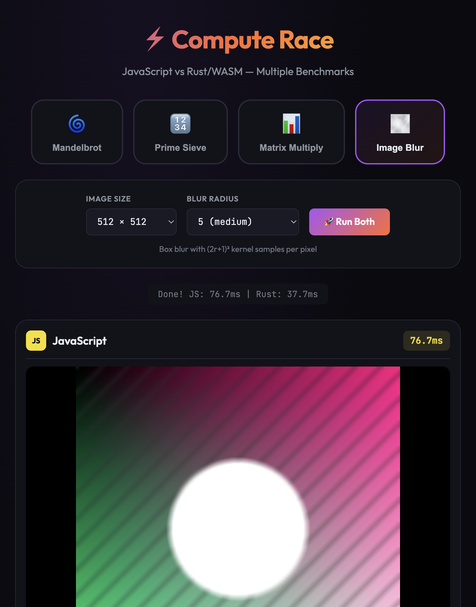

# Benchmark Results

All results are from the **second run** to avoid WASM initialization overhead.

## Test Environment

| Component | Specification |
|-----------|---------------|
| **CPU** | Apple M4 Pro (14 cores: 10P + 4E) |
| **Memory** | 24 GB |
| **OS** | macOS |
| **Browser** | Chrome |

---

## 🌀 Mandelbrot Set (768×768, 1000 iterations)

| Implementation | Time |
|----------------|------|
| JavaScript | 133.2ms |
| Rust/WASM | 36.9ms |
| **Speedup** | **3.6×** |

---

## 🔢 Prime Sieve (10 Million)

| Implementation | Time | Primes Found |
|----------------|------|--------------|
| JavaScript | 14.0ms | 664,579 |
| Rust/WASM | 7.7ms | 664,579 |
| **Speedup** | **1.8×** | — |

---

## 📊 Matrix Multiplication (512×512)

| Implementation | Time | Operations |
|----------------|------|------------|
| JavaScript | 127.6ms | 268,435,456 |
| Rust/WASM | 90.1ms | 268,435,456 |
| **Speedup** | **1.4×** | — |

---

## 🌫️ Image Blur (512×512, radius 5)

| Implementation | Time |
|----------------|------|
| JavaScript | 65.9ms |
| Rust/WASM | 39.2ms |
| **Speedup** | **1.7×** |

---

## Summary

| Benchmark | Rust Advantage | Why |
|-----------|----------------|-----|
| Mandelbrot | ~3.6× | SIMD processes 4 pixels at once |
| Prime Sieve | ~1.8× | Better memory efficiency, no GC |
| Matrix Multiply | ~1.4× | Cache-optimized, predictable performance |
| Image Blur | ~1.7× | Efficient pixel buffer access |

> **Note**: Results may vary depending on browser, CPU, and system load. Modern JS engines (V8, SpiderMonkey) are highly optimized. Rust/WASM wins through SIMD, memory control, and predictable execution.
